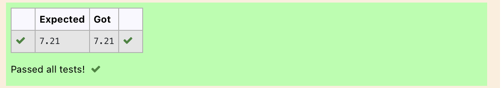

# DISTANCE-BETWEEN-TWO-POINTS

## AIM:
To write a python program to find the distance two 2 points
## ALGORITHM:
### Step 1: 
import math
### Step 2: 
get the value from the user
### Step 3: 
Substitute the values in the distance formula  
### Step 4: 
use the given formula
### Step 5: 
print the value

### PROGRAM:
~~~
  import math
x=[10,4]
y=[6,2]
dist=math.sqrt(((x[1]-x[0])**2)+((y[1]-y[0])**2))
print("{:.2f}".format(dist))
~~~

### OUTPUT:

### RESULT:
successfully finded the distance between two points
